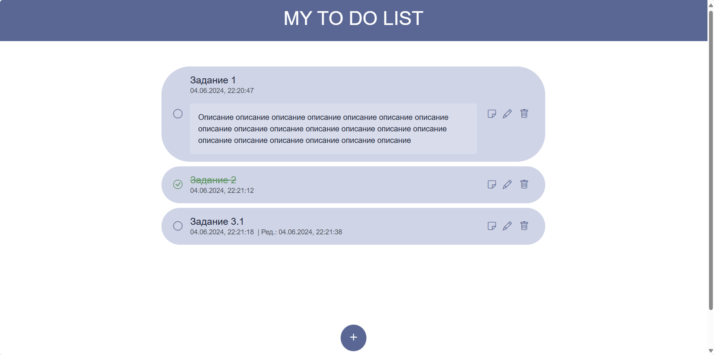

# MY TO DO LIST :bookmark_tabs:
___

- [X] Добавление новой задачи (с указанием даты и времени создания)
- [X] Редактирование задачи  (с указанием даты и времени редактирования)
- [X] Удаление задачи
- [X] Отметка о выполнении задачи (по умолчанию: не выполнено)

